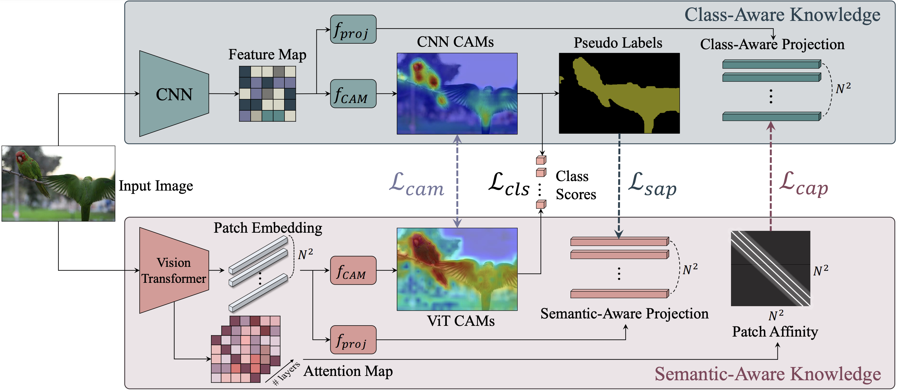
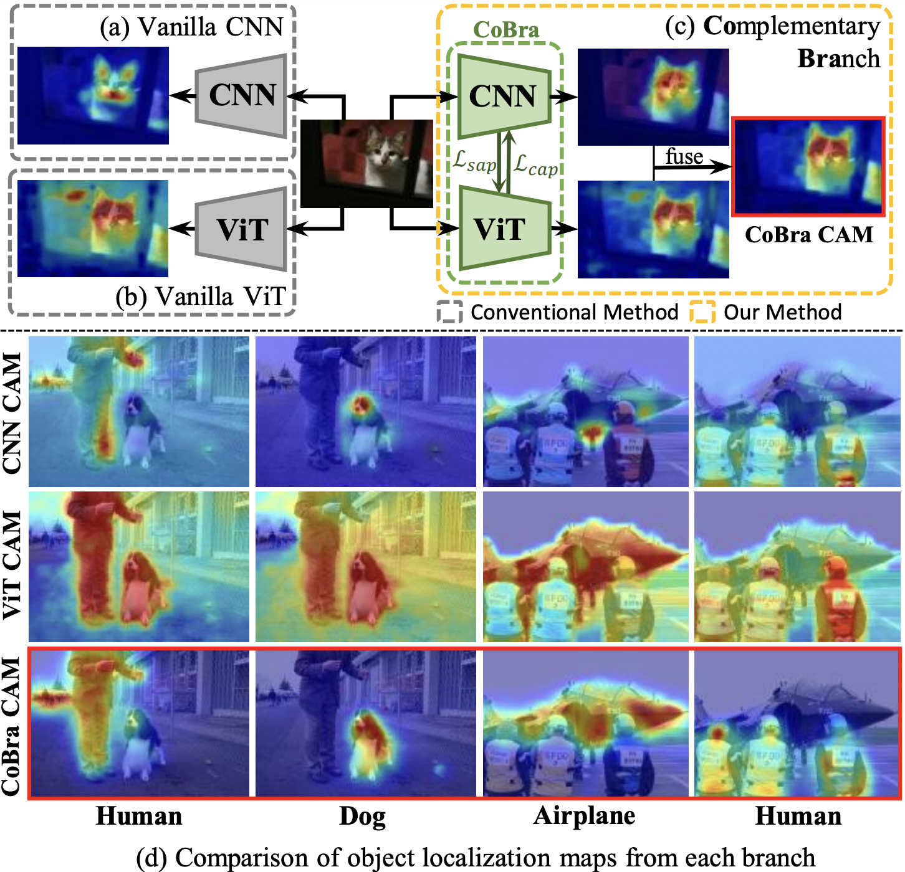
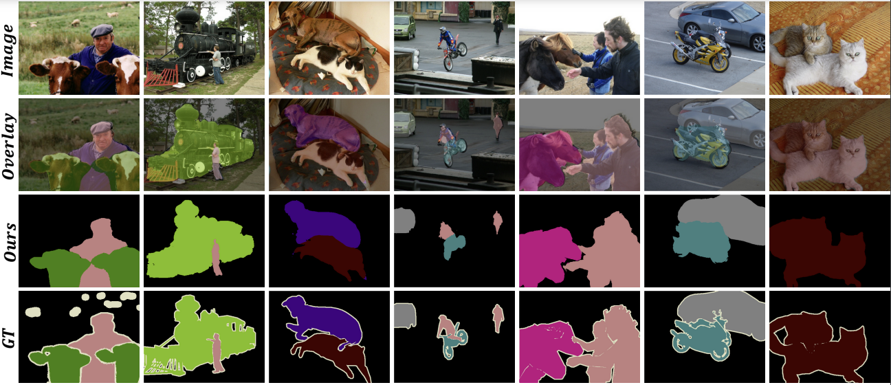
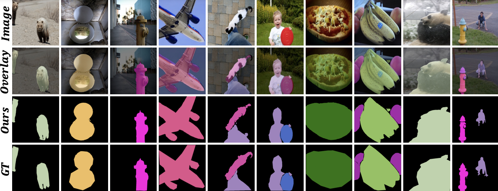

# CoBra 🐍 : Complementary Branch Fusing Class and Semantic Knowledge for Robust Weakly Supervised Semantic Segmentation

[[Project Page]](https://anno9555.github.io/)



We propose **Complementary Branch (CoBra)**, a novel dual branch framework consisting of two distinct architectures which provide valuable complementary knowledge of class (from CNN) and semantic (from vision transformer) to each branch. In particular, we learn **Class-Aware Projection (CAP)** for the CNN branch and **Semantic-Aware Projection (SAP)** for the vision transformer branch to explicitly fuse their complementary knowledge and facilitate a new type of extra patch-level supervision. Extensive experiments qualitatively and quantitatively investigate how CNN and vision transformer complement each other on the PASCAL VOC 2012 dataset showing a state-of-the-art WSSS result.

## :book: Contents
<!--ts-->
   * [Prerequisite](#Prerequisite)
   * [Usage](#Usage)
      * [Pretrained Weight](#Pretrained-Weight)
   * [About CoBra](#About-CoBra)
<!--te-->


## 🔧 Prerequisite
- Download [PASCAL VOC2012 devkit](http://host.robots.ox.ac.uk/pascal/VOC/voc2012/)
- Ubuntu 20.04, with Python 3.10 and the following python dependencies.
```bash
pip install -r requirements.txt
```

## 💻 Usage
**Step1:**
- Run the run.sh script for training Cobra, it makes **Seed** and elements for making better Mask.
- We train [IRNet](https://github.com/jiwoon-ahn/irn) to generate mask to refine Seed.

- change ```title``` and ```pascal_dataset_path``` in run shell script.
```bash
bash run.sh
```

### 🏋️ Pretrained Weight
<table style="margin: auto">
  <tr>
    <td align="center">CAK Branch</td>
    <td align="center"><i>ep19_cnn_checkpoint.pth</i></td>
    <td><a href="https://drive.google.com/file/d/1X0kn_imyesfKlguBWqoysar5_4RWMFZ1/view?usp=sharing](https://drive.google.com/drive/folders/1ZUCTrz7J4eCUrMTLgbaqHEJqqW_ZYamy?usp=sharing">link</td>
  </tr>
  <tr>
    <td align="center">SAK Branch</td>
    <td align="center"><i>ep19_tran_checkpoint.pth</i></td>
    <td><a href="https://drive.google.com/file/d/1GAEO-Qta_iUnR1ptZL7z5ZTiCuTA9QWx/view?usp=sharing](https://drive.google.com/drive/folders/1ZUCTrz7J4eCUrMTLgbaqHEJqqW_ZYamy?usp=sharing">link</td>
  </tr>
</table>


**Step2:** For the Segmentation part, we used DeepLabV2 with resnet101 backbone and MiT-B2 backbone.
- DeepLabV2 (https://github.com/kazuto1011/deeplab-pytorch)


## 🐍 About CoBra
<center>
</center>

### Results
- Qualitative Results on Pascal VOC 2012 dataset.
  


- Qualitative Results on MS-COCO 2014 dataset.
  


## :scroll: Acknowledgement
This repository has been developed based on the [IRNet](https://github.com/jiwoon-ahn/irn) repository. Thanks for the good work!

